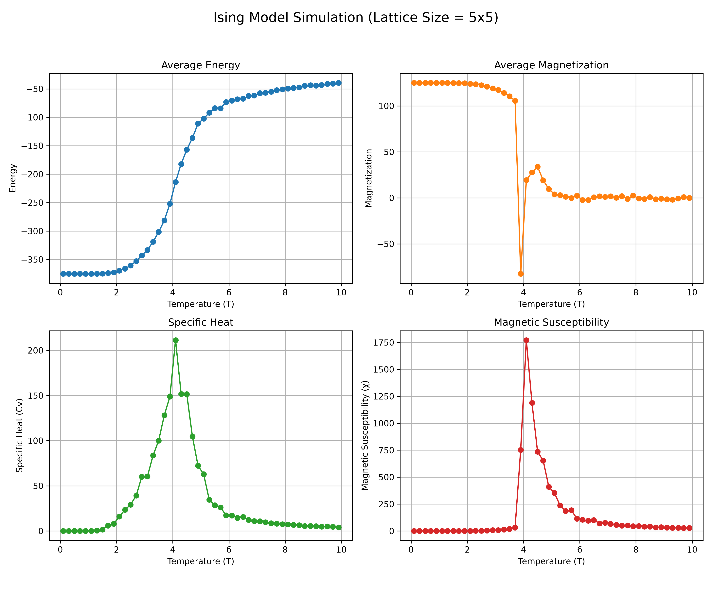

# 2D & 3D Ising Model Monte Carlo Simulation

A Python implementation of the **2D and 3D Ising Model** using **Markov Chain Monte Carlo (MCMC)** and the **Metropolis-Hastings Algorithm**. This project simulates phase transitions and computes thermodynamic properties near critical temperatures.



---

## 📌 Physics Background

The **Ising Model** represents a lattice of interacting magnetic dipole moments (spins $s_i \in \{-1, +1\}$). The energy of the system is governed by the Hamiltonian:

$$E = -J \sum_{\langle i, j \rangle} s_i s_j - H \sum_i s_i$$

* **$J$**: Interaction strength between nearest neighbors.
* **$H$**: External magnetic field strength.
* **$\langle i, j \rangle$**: Summation over nearest-neighbor pairs.

Using the **Metropolis Algorithm**, spin flips are accepted deterministically if $\Delta E \le 0$, or stochastically with probability $P = e^{-\Delta E / k_B T}$ if $\Delta E > 0$.

### Thermodynamic Quantities Calculated:
* **Average Energy:** $\langle E \rangle$
* **Average Magnetization:** $\langle M \rangle$
* **Specific Heat ($C_v$):** $C_v = \frac{\langle E^2 \rangle - \langle E \rangle^2}{T^2}$
* **Magnetic Susceptibility ($\chi$):** $\chi = \frac{\langle M^2 \rangle - \langle M \rangle^2}{T}$

> **Project History Note:** Originally developed as a computational physics project in college, later refactored into a modular, command-line configurable Python package.

---

## 📁 Repository Structure

```text
ising-model-simulation/
├── plots/                  # Output visualization figures
│   └── simulation_result.png
├── src/                    # Core simulation package
│   ├── __init__.py
│   ├── lattice.py          # Spin array initializations (2D/3D)
│   ├── physics.py          # Hamiltonian & thermodynamic calculations
│   ├── monte_carlo.py       # Metropolis MCMC sampling engine
│   └── visualization.py    # Matplotlib plotting scripts
├── .gitignore
├── main.py                 # CLI entry point
├── README.md               # Project documentation
└── requirements.txt        # Python dependencies
```

## 🚀 Quickstart & Usage

### 1. Setup Environment
Clone the repository, set up a virtual environment, and install dependencies:

```bash
git clone https://github.com/srjaiswal44-png/ising-model-simulation.git
cd ising-model-simulation
python -m venv venv
```

Activate the environment:
* **Windows (PowerShell):** `.\venv\Scripts\Activate.ps1`
* **Windows (CMD):** `.\venv\Scripts\activate.bat`
* **Mac/Linux:** `source venv/bin/activate`

Install required packages:
```bash
pip install -r requirements.txt
```

### 2. Run Simulation
Run a 3D simulation with default settings ($5 \times 5 \times 5$ lattice):
```bash
python main.py --size 5 --dim 3 --eq-steps 1000 --meas-steps 1000
```
Run a **2D simulation** ($20 \times 20$ lattice):
```bash
python main.py --size 20 --dim 2 --eq-steps 1000 --meas-steps 1000
```

### 3. Command Line Arguments
```bash
python main.py --help
```